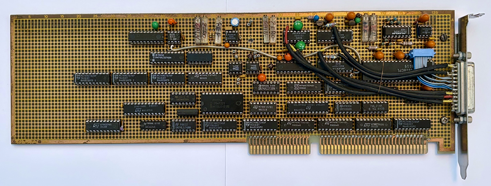
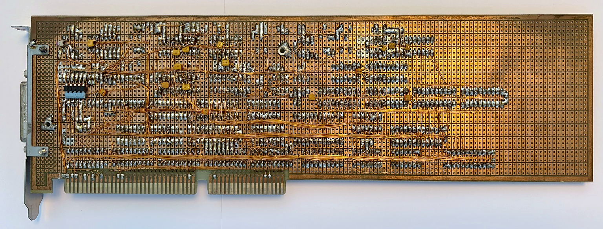
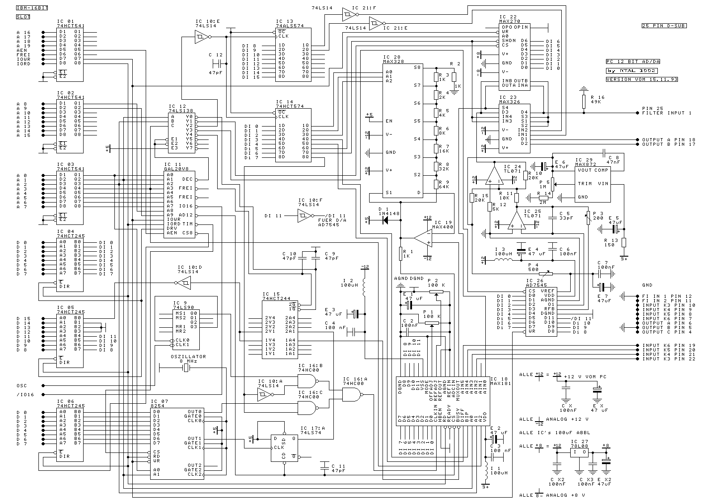
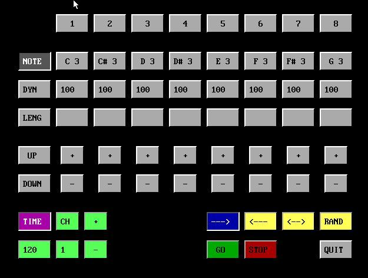
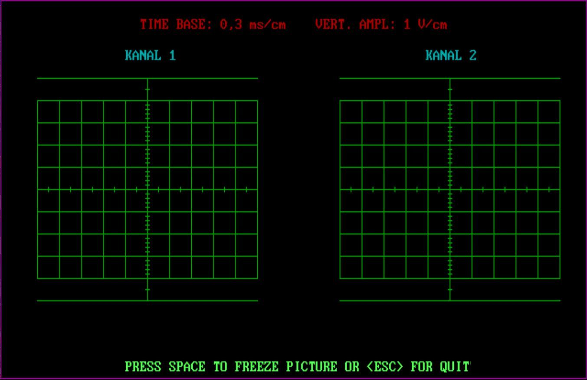
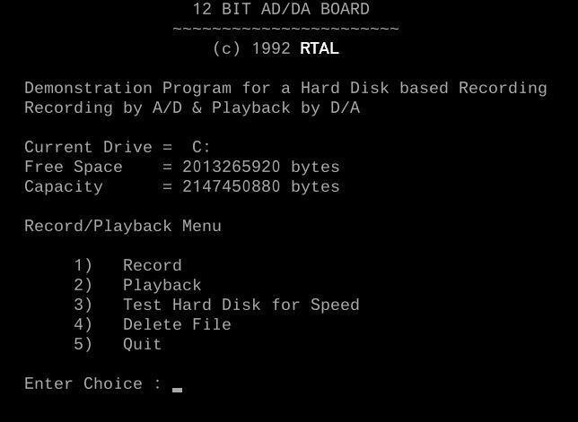
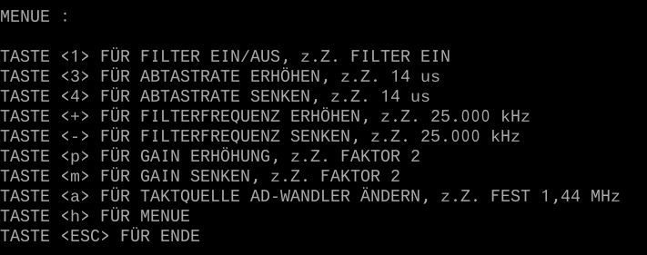
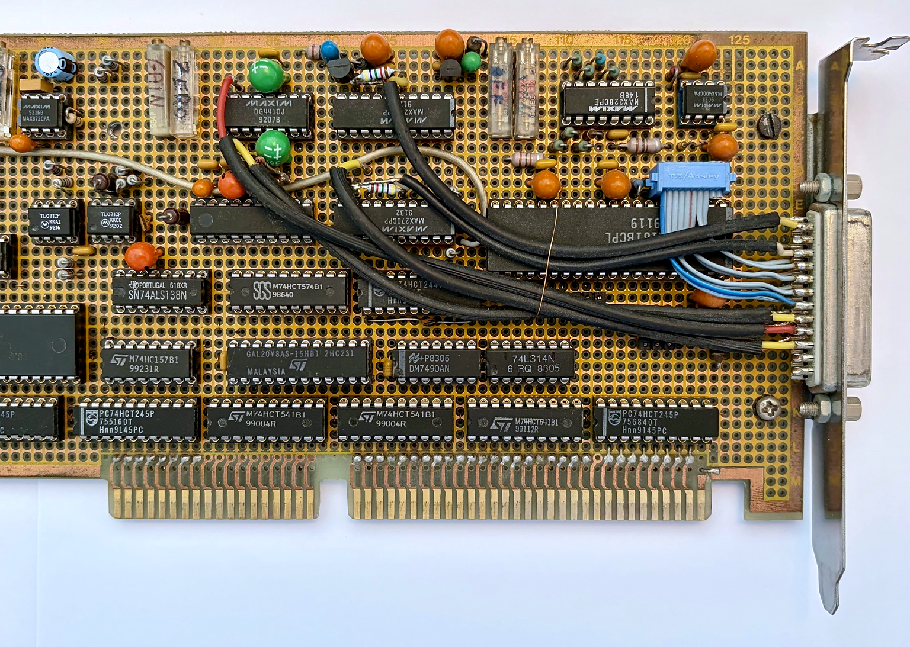
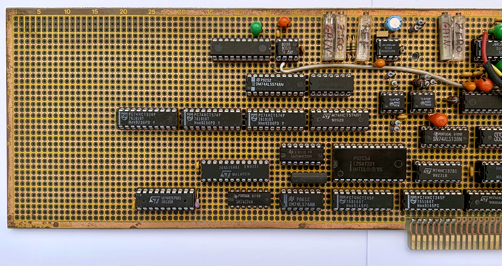

# RTAL-CDAD-003-Multi-Channel-Data-Acquisition-and-Audio-Processing-System
## A Hand-Built 12-Bit Multi-Channel Data Acquisition and Audio Processing System for the IBM PC ISA Bus


**RTAL ISA Multi Channel Data Aquisition and Audio Processing System** is a self-developed multi-channel 12-bit ADC/DAC board for the IBM PC ISA bus. It was designed and built in 1992 as an affordable, flexible alternative to the expensive commercial data-acquisition cards available at the time.

The project combines analog acquisition, analog output, programmable filtering, software-controlled input-range adaptation, precision timing, digital I/O, and a substantial collection of DOS software written in **Microsoft C 6.00** with time-critical routines in **x86 assembler**.

The hardware was constructed on prototyping board and wired by hand using point-to-point wiring / wire-wrap-style wiring. This was not merely a cost-saving measure: the architecture evolved through many iterations, and the construction method made modifications, experiments, repairs, and extensions practical. Despite its prototype character, the board proved highly reliable in operation.

> This repository preserves the complete engineering context: hardware, schematic, board photographs, source code, executables, build scripts, application experiments, and screenshots of the original software.

---

## Gallery

### Component side



*Component side of the hand-built ISA board.*

### Wiring side



*The wiring side documents the point-to-point / wire-wrap construction and the numerous design iterations.*

### Complete schematic

[Download the complete A3 schematic](schematic/RTAL_MCDA_APS_.png)



### Original software









---

## Why I Built This Board

In the early 1990s, commercial multi-channel ADC/DAC cards for the PC ISA bus were available, but their prices were far beyond my personal budget. At the same time, the IBM-compatible PC offered enough computing power to become an experimental platform for digital signal processing, audio recording, measurement, speech analysis, and real-time effects.

The solution was to design and build my own data-acquisition system.

The goal was not simply to copy a commercial card. I wanted a flexible laboratory platform with:

- multiple analog input channels,
- 12-bit conversion,
- analog output,
- programmable anti-aliasing and reconstruction filters,
- software-selectable sensitivity,
- accurate programmable timing,
- direct low-level access from C and assembler,
- and enough flexibility for both measurement and audio applications.

This board became the hardware basis for experiments including speech recognition, waveform analysis, FFT and DFT displays, oscilloscope software, hard-disk recording, signal generation, and early real-time audio effects.

---

## Historical Context

In 1992, a standard PC was not yet an integrated multimedia workstation. High-quality audio acquisition required dedicated hardware, careful timing, explicit port I/O, and custom software. Continuous recording to hard disk, graphical spectral analysis, and real-time digital effects were demanding tasks on 80286- and 80386-class systems.

The source archive reflects this environment:

- direct ISA I/O instructions rather than a modern driver API,
- DOS graphics modes and Microsoft graphics libraries,
- segmented-memory models and `huge` allocations,
- explicit interrupt masking for timing-critical loops,
- 80286 assembler,
- x87 floating-point build options,
- hand-managed acquisition and playback buffers,
- and batch files that invoke Microsoft C and MASM directly.

---

## Technical Overview

| Function | Implementation |
|---|---|
| Host interface | IBM PC 16-bit ISA bus, I/O mapped |
| ADC system | MAX181 complete 12-bit data-acquisition system |
| Analog inputs | Six multiplexed analog channels provided by MAX181 |
| Maximum ADC capability | Up to 100 ksample/s device capability |
| DAC | AD7545 12-bit buffered multiplying DAC |
| Analog filtering | MAX270 digitally programmed dual second-order continuous-time low-pass filter |
| Programmable range/reference network | MAX328 analog multiplexer, precision resistor ladder, and MAX400 amplifier stage |
| Timing | Programmable 8254 counter/timer driven from an 8 MHz source |
| Bus buffering and registers | 74HCT245, 74HCT541, 74HCT574 and related logic |
| Address decoding | GAL20V8 and 74LS138-class decode logic |
| Digital control | Latched configuration and mode registers |
| External connection | 25-pin D-sub interface |
| Construction | Prototyping board, point-to-point / wire-wrap-style wiring |
| Main development tools | Microsoft C 6.00 and Microsoft Macro Assembler |
| Original operating environments | MS-DOS; selected programs later usable under Windows XP |

---

## System Architecture

```text
                           IBM PC ISA BUS
                                  │
             ┌────────────────────┴────────────────────┐
             │ ISA buffering, latches and address     │
             │ decoding (GAL20V8 / TTL logic)          │
             └───────────────┬─────────────────────────┘
                             │
       ┌─────────────────────┼─────────────────────────────┐
       │                     │                             │
       ▼                     ▼                             ▼
  8254 Timer          Control Registers              Digital I/O
       │                     │
       │                     ├──────── Filter programming
       │                     ├──────── Gain / range selection
       │                     ├──────── Clock source and mode
       │                     └──────── Input / output routing
       │
       ├──────── ADC conversion timing
       └──────── Software-defined sample rate

 Analog Inputs 1...6
       │
       ▼
 MAX181 input multiplexer and track/hold
       │
       ▼
 MAX270 programmable low-pass filtering
       │
       ▼
 MAX181 12-bit conversion
       │
       ▼
 ISA data registers ───────────────► PC software

 PC software
       │
       ▼
 AD7545 12-bit DAC
       │
       ▼
 MAX270 reconstruction filtering / analog output stage
       │
       ▼
 Analog output
```

The schematic should be treated as the authoritative source for the exact signal routing. The block diagram above is a functional overview intended to make the system easier to understand.

---

## Hardware Architecture in Detail

### 1. ISA Bus Interface

The board plugs into a 16-bit IBM-compatible ISA slot. Address and control signals are decoded locally, while bidirectional transceivers and latches isolate the PC bus from the analog and control sections.

The interface uses conventional logic devices including:

- **74HCT245** bidirectional bus transceivers,
- **74HCT541** input buffers,
- **74HCT574** octal latches,
- **74LS138** address decoding,
- and a **GAL20V8** for project-specific decode and control logic.

The software accesses the hardware directly using Microsoft C functions such as `inp()`, `inpw()`, `outp()`, and `outpw()`. No operating-system driver layer is present.

### 2. MAX181 12-Bit Data-Acquisition System

The MAX181 is the central analog-to-digital converter. It integrates several functions that would otherwise have required separate ICs:

- six-channel analog input multiplexer,
- track-and-hold stage,
- 12-bit successive-approximation ADC,
- internal precision reference circuitry,
- conversion/status logic,
- and a microprocessor-compatible parallel interface.

The original device is specified as a complete 100 ksample/s data-acquisition system. In this project, the actual sampling rate is controlled by the board timing and application software and is selected to match the required bandwidth and processing workload.

The software archive shows both addressed and fixed-channel acquisition modes. Programs poll the conversion/status register and then read the 12-bit sample through the selected ADC port. Bipolar samples are commonly translated in software by adding `0x800` and masking to 12 bits.

### 3. Six Analog Input Channels

The MAX181 provides six multiplexed analog inputs. The software includes a multi-channel readout program (`PRADALL.C`) that acquires and displays all six channels. Other applications select one or two channels for oscilloscope, spectral-analysis, speech, or stereo-audio operation.

This made the board suitable for more than audio alone. It could also be used for general laboratory measurements, sensor acquisition, control experiments, and simultaneous observation of several analog signals.

### 4. MAX270 Programmable Dual Low-Pass Filter

One of the most distinctive features of the board is the **MAX270**, a digitally programmed dual second-order continuous-time low-pass filter.

Its two filter sections can be programmed independently. In the software archive they are referred to as **Filter A** and **Filter B**. The programs write a filter-section command to the control port and then write an 8-bit frequency value to the associated frequency register.

The source code contains a complete 128-entry frequency table covering approximately:

```text
1.000 kHz ... 25.000 kHz
```

This enables the cutoff frequency to be changed interactively from software.

The filter performs several jobs:

- anti-aliasing before analog-to-digital conversion,
- bandwidth limitation for measurement and speech experiments,
- adaptation of the analog bandwidth to the selected sampling rate,
- reconstruction filtering after digital-to-analog conversion,
- and deliberate tone shaping in audio applications.

The `MONO.C` and `STEREO.C` programs allow the user to switch the filter on and off and change its cutoff frequency while the system is running. This was a significant advantage over simple ISA converter cards with fixed analog filtering.

### 5. MAX328-Based Programmable Reference and Range Network

The **MAX328 is not itself a voltage-reference IC**. It is an ultra-low-leakage, single-ended CMOS analog multiplexer. In this design it is used as the selection element of a programmable analog reference/range circuit.

The MAX328 selects one of several taps from a precision resistor network. The selected voltage is processed and buffered by the **MAX400** precision amplifier stage and applied to the MAX181-related reference/range circuitry.

This arrangement provides a software-controlled sensitivity or gain/range function. The original control software exposes eight gain settings:

```text
1, 2, 4, 8, 16, 32, 64, 128
```

The practical benefits are:

- better use of the 12-bit ADC resolution for low-level signals,
- adaptation to widely different input amplitudes,
- software-controlled measurement ranges,
- no mechanical range switch,
- repeatable settings under program control,
- and the possibility of changing sensitivity as part of an automated measurement process.

This MAX328/resistor-ladder/MAX400 circuit is one of the most original and technically interesting elements of the board.

### 6. AD7545 12-Bit DAC

The analog output is based on an **AD7545**, a 12-bit CMOS multiplying DAC with integrated data latches. The PC writes 12-bit values directly to the DAC register.

The DAC was used for:

- sampled-audio playback,
- sine-wave generation,
- reconstructed test signals,
- processed audio output,
- and early digital effects.

`SINUS.C`, for example, calculates a 100-point sine table and repeatedly writes it to the DAC. Other applications pass acquired or processed samples to the same output path.

### 7. 8254 Programmable Timer

A programmable **8254 timer** provides precise hardware timing. The software initializes multiple counters through control and data registers.

The source comments document, among other settings:

- a generated clock around 1.6 MHz for the ADC timing path,
- programmable conversion delays,
- timer-derived sampling clocks,
- and separate timing values for different acquisition rates.

`MONO.C` and `STEREO.C` permit interactive adjustment of the sampling rate. The timer therefore separates time-critical acquisition from the variable execution speed of the PC software.

### 8. External Clock and Mode Control

The control registers combine several hardware options, including:

- internal 8254 clock or an alternative clock source,
- filter enable/bypass,
- bipolar operation,
- gain/range selection,
- Filter A or Filter B programming,
- and analog output routing.

The exact bit assignments evolved during development and should be documented alongside the specific source revision rather than assumed to be identical across all programs.

### 9. Physical Construction

The board was built on prototyping board rather than as an etched PCB. Connections were made by hand using point-to-point wiring / wire-wrap-style techniques.

This construction method was selected because the system was developed through many iterative stages. It allowed:

- signals to be rerouted without manufacturing a new PCB,
- analog stages to be optimized experimentally,
- address and control logic to be changed,
- new functions to be added,
- errors to be corrected quickly,
- and individual circuit blocks to be replaced or extended.

The completed board nevertheless proved highly reliable. The wiring-side photograph is therefore an important part of the engineering documentation, not merely a construction detail.

---

## Why So Many Maxim Components?

Maxim offered a well-known **free sample program** at the time. Through sample requests to the United States and the German distributor, the specialist ICs used in this design were supplied at no cost.

This made it possible to build a sophisticated data-acquisition platform despite a limited personal budget. Components such as the MAX181, MAX270, MAX328, and MAX400 provided levels of integration and analog performance that would otherwise have been financially inaccessible.

The project is therefore also an example of how engineering creativity, component-sample programs, and careful system design could overcome significant cost constraints.

---

# Original Software Archive

The software is a central part of the project. The uploaded archive contains C source files, executable files, batch build scripts, object files, Microsoft graphics fonts, and an 80286 assembler module.

Most programs were written for **Microsoft C 6.00**. Time-critical sections use either inline assembly or external Microsoft MASM modules. The code directly accesses ISA ports and is intended for real DOS or a sufficiently compatible environment.

## Software Inventory

| Program / source | Purpose |
|---|---|
| `PCAD1.C`, `PCAD2.C` | Integrated menu-driven control and analysis environment |
| `PRADALL.C` | Acquisition and display of all six ADC channels |
| `SCOPE1.C` | Single-channel graphical oscilloscope |
| `SCOPE2.C` | Dual-channel graphical oscilloscope |
| `DFT.C` | Direct discrete Fourier transform for up to 128 samples |
| `FFT.C` | FFT-based spectrum analysis for up to 1024 samples |
| `MONO.C` | Interactive monophonic acquisition/output control |
| `STEREO.C`, `STEREO1.C` | Interactive stereo acquisition/output control |
| `SINUS.C` | Sine-wave generation through the AD7545 DAC |
| `HALL.C` | Experimental real-time reverberation / recursive audio processing |
| `SPEECH.C` | Speech sample acquisition and voice-related processing front end |
| `HD-Recording/SAMPLE*.C` | Direct sampling, playback, memory, and disk-recording experiments |
| `HD-Recording/HDRECORD.C` | Hard-disk recorder user interface and disk-management framework |
| `HD-Recording/HDREC286.ASM` | 80286 assembly routines for block-based recording/playback |
| `fonts` | used fonts |

---

## Integrated PCAD Application

`PCAD1.C` and `PCAD2.C`, together with `MENU.C`, form a larger graphical application environment. The code includes:

- graphical menus,
- date and system displays,
- channel selection,
- voltage measurement,
- DFT analysis,
- oscilloscope functions,
- speech-related functions,
- and direct configuration of the board registers.

Microsoft graphics fonts (`*.FON`) and the Microsoft graphics library are used to create the DOS user interface.

The application demonstrates that the board was intended as a reusable platform rather than as a single-purpose converter.

---

## Oscilloscope Applications

### `SCOPE1.C`

The single-channel oscilloscope allocates storage for approximately 2,000 values, acquires samples from a selected ADC channel, and draws the waveform using the Microsoft C graphics API.

It includes:

- selectable channel input,
- graphical graticule and waveform display,
- time-base-related processing,
- amplitude scaling,
- and DOS font support.

### `SCOPE2.C`

The dual-channel version allocates separate buffers for two input channels and displays both waveforms. It initializes both MAX270 filter sections and the board timing before acquisition.

This program demonstrates practical use of the MAX181 multi-channel capability and the two independently programmable MAX270 sections.

---

## FFT and DFT Analysis

### Direct Fourier Transform

`DFT.C` performs a direct discrete Fourier transform on up to 128 acquired samples. It calculates real and imaginary components, RMS-related values, and a graphical spectrum.

The program is computationally expensive but straightforward and useful for verification and educational analysis.

### Fast Fourier Transform

`FFT.C` supports data blocks of up to 1,024 samples and implements a faster spectral-analysis path. The source includes:

- acquisition from the ADC,
- sample conversion to 12-bit bipolar representation,
- transform buffers for real and imaginary components,
- a window array,
- RMS and average calculations,
- and graphical output in a high-resolution 16-color DOS mode.

These programs turned the ISA board into a PC-based signal and spectrum analyzer.

---

## Multi-Channel Measurement

`PRADALL.C` reads all six MAX181 input channels and displays their values side by side. It supports two channel-selection approaches described in the program as:

- channel selected through the address,
- or channel fixed through a control register.

The code also polls the conversion status and performs repeated reads to obtain stable conversion results.

This application is particularly representative of the board's original role as a general-purpose data-acquisition system.

---

## Mono and Stereo Audio Control

`MONO.C` and `STEREO.C` are interactive audio-control programs rather than simple test utilities.

They provide keyboard control of:

- MAX270 filter enable/bypass,
- filter cutoff frequency,
- ADC sampling rate,
- timer configuration,
- internal or external clock source,
- gain/range selection from 1 to 128,
- and output operating mode.

The source includes a 128-step table of filter cutoff values from approximately 1 kHz to 25 kHz. The sample-rate timer values can also be modified while the program is running.

The stereo program uses the large memory model and optimized 80286 code-generation options, illustrating the need to balance memory capacity and execution speed on the PCs of the period.

---

## Speech Recognition Experiments

`SPEECH.C` and the `VOICES` directory preserve software from the speech-processing experiments.

The workflow includes:

1. initializing the ADC, filter, and timing hardware,
2. acquiring approximately 12,000 speech samples,
3. loading and storing reference patterns,
4. passing sample blocks to an external voice-processing object module,
5. and comparing or playing stored voice material.

The wider project used **linear predictive coding (LPC) analysis** as the basis for speech recognition. LPC was well suited to the computing resources of the period because it models the spectral envelope of speech using a relatively small set of predictor coefficients.

The archive contains compiled object code (`VOICESUB.OBJ`) in addition to the C front end. Where original assembler or C source for that object is no longer available, it should be identified as a preserved binary component rather than reconstructed or replaced.

---

## Hard-Disk Recording

The `HD_Rec` directory documents several stages of recording and playback development.

### Direct PCADDA experiments

The `SAMPLE*.C` programs directly configure the programmable filters, timer, ADC, and DAC at several historical base addresses. They explore:

- large `huge`-memory buffers,
- acquisition of hundreds of thousands of samples,
- writing reference samples to disk,
- loading and playing samples,
- and moving continuously acquired data between converter, memory, and storage.

These programs show the path from short sample capture toward practical hard-disk recording.

### Block-based recorder framework

`HDRECORD.C` provides the recorder user interface, disk-space checks, filename handling, recording-time calculations, playback control, and error reporting.

`HDREC286.ASM` is an 80286 assembler module using:

- 12,288 samples per block,
- 16-bit stereo words,
- 49,152-byte transfer blocks,
- double-buffer-related logic,
- and low-level file recording/playback routines.

This assembler module also contains references to DSP32C receive buffers. It therefore represents a later or parallel recorder configuration involving an additional DSP32C data path, not solely the basic ISA ADC/DAC hardware. It is preserved here because it belongs to the historical software development surrounding the board, but the distinction should remain explicit.

---

## Early Audio Effects

### Reverberation / recursive filter experiment

`HALL.C` reads an ADC value, processes it with a short recursive equation, retains previous input and output states, and writes the result to the DAC.

The surviving program is compact and experimental, but it documents an important objective of the project: using the PC and ISA hardware for real-time audio transformation rather than only recording and measurement.

### Signal generation

`SINUS.C` creates a sine lookup table and writes it repeatedly to the 12-bit DAC. This provided a convenient output test, signal source, and basis for later synthesis or effect experiments.

---

## Direct Hardware Programming

A typical initialization sequence found throughout the code performs the following operations:

```c
/* Historical example, addresses depend on the board revision/configuration. */
outpw(CONTROL_PORT, FILTER_A_COMMAND);
outpw(FILTER_FREQUENCY_PORT, cutoff_value);
outpw(CONTROL_PORT, FILTER_B_COMMAND);
outpw(FILTER_FREQUENCY_PORT, cutoff_value);

outp(TIMER_CONTROL_PORT, TIMER0_MODE);
outp(TIMER0_DATA_PORT, timer_low);
outp(TIMER0_DATA_PORT, timer_high);

outp(TIMER_CONTROL_PORT, TIMER1_MODE);
outp(TIMER1_DATA_PORT, sample_period_low);
outp(TIMER1_DATA_PORT, sample_period_high);
```

A conversion loop commonly follows this pattern:

```c
/* Simplified from the original programs. */
do {
    status = inpw(STATUS_PORT);
} while (status & 0x8000);

sample = inpw(ADC_CHANNEL_PORT);
sample = (sample + 0x800) & 0x0fff;
```

For strict historical preservation, the repository should keep the original source unchanged. Modernized or annotated versions should be stored separately.

---

## Historical I/O Address Variants

The software archive contains several I/O address ranges, including bases around:

```text
0x280
0x300
0x310
0x320
0x330
```

This is evidence of development iterations, address-selection changes, or different test configurations. Examples include:

- ADC reads around `0x280`, `0x288`, and related offsets,
- status reads around `0x290`, `0x298`, or corresponding shifted ranges,
- filter frequency and control writes around `0x292` / `0x294`,
- DAC writes around `0x296`,
- timer registers around `0x28C` to `0x28F`,
- and mode control around `0x29C`.

The `HD_Rec/SAMPLE*.C` revisions use analogous maps shifted to other bases.

For this reason, there is no single universal register table that can safely be applied to every historical source file. A future documentation step should correlate:

1. jumper or GAL configuration,
2. schematic decode equations,
3. each software revision,
4. and the corresponding base address.

### Representative map used by many programs

| Address | Observed function in source code |
|---:|---|
| `0x280` and channel-dependent offsets | ADC data / channel reads |
| `0x290` | ADC status / conversion state |
| `0x292` | MAX270 frequency programming data |
| `0x294` | Filter, gain, clock, bipolar, and routing control |
| `0x296` | 12-bit DAC data output |
| `0x28C` | 8254 counter 0 data |
| `0x28D` | 8254 counter 1 data |
| `0x28E` | 8254 counter 2 data |
| `0x28F` | 8254 control register |
| `0x29C` | ADC/channel operating mode control |

This table is derived from the software and is intentionally described as representative rather than definitive for every revision.

---

## Build Environment

The batch files preserve the original compiler commands. Typical examples are:

```bat
cl /AS /FPi87 /G2 scope1.c
cl /AL /Ot /Ol /FPi87 /G2 stereo.c
cl /AL /FPc87 fft.c
```

These options indicate:

- small or large memory models,
- 80286 code generation,
- optional 8087/80287 floating-point support,
- and optimization for time and loop execution.

The speech application links an external object module:

```bat
cl /AL /FPi87 /c /G2 speech.c
link speech voicesub,,,;
```

The hard-disk recorder assembler module was built using Microsoft MASM 5.0-style syntax:

```bat
masm /b63 /v /w2 /z HDREC286.ASM;
```

### Expected historical toolchain

- MS-DOS or a compatible DOS environment
- Microsoft C 6.00
- Microsoft Macro Assembler 5.x/6.x, depending on module
- Microsoft graphics library and `.FON` files
- EGA/VGA-compatible graphics hardware
- x87 coprocessor or emulator for builds using `/FPi87`
- an ISA PC containing the board at the matching configured base address

The provided `.EXE` files may run without rebuilding, but only in an environment compatible with direct ISA port I/O.

---

## Running the Software Today

### Real hardware

The most authentic setup is:

- an ISA-capable 286, 386, 486, or early Pentium PC,
- MS-DOS,
- EGA or VGA graphics,
- and the RTAL ISA AnalogLab 12 board installed at the expected I/O address.

### Windows XP

Some programs may run under 32-bit Windows XP because its DOS virtual machine can execute many 16-bit DOS applications. Direct hardware I/O may still depend on system configuration and permissions.

### DOSBox and emulation

DOSBox or DOSBox-X can be useful for inspecting menus and graphics, but ordinary emulation does not automatically emulate this custom ISA board. Programs that directly access its ports will require:

- the real board passed through by a suitable environment,
- a custom emulator extension,
- or a modified software build using simulated ADC/DAC data.

A future emulator or mock-hardware layer would be an interesting preservation project.

---

## Preservation Guidelines

The original archive contains files produced by historical compilers and development tools. For preservation purposes:

- retain original filenames and timestamps where possible,
- store untouched source files in an `original` directory,
- avoid silently changing character encoding,
- note that German source comments use DOS code-page characters,
- preserve `.BAT`, `.OBJ`, `.MAP`, `.SYM`, `.ILK`, `.FON`, and `.EXE` files,
- place cleaned or annotated source in a separate directory,
- document which binaries can be rebuilt and which depend on missing objects,
- and record the exact board base address required by each program.

---

## Known Limitations

- The hardware requires an ISA bus and cannot be connected directly to a modern PC.
- The software uses direct port I/O and has no modern protected-mode driver.
- Several source files represent different development revisions and I/O base addresses.
- Some executable or object modules may have no surviving source.
- The original programs assume DOS graphics and segmented memory models.
- The schematic and construction documentation are historical and should be reviewed before reproducing the hardware.
- The 100 dpi schematic print export is a rasterized historical rendering, even though the corrected assembled PDF provides a convenient full-sheet view.

---

## What This Project Demonstrates

RTAL ISA Multi Channel Data Aquisition and Audio Processing System is more than a home-built ADC/DAC card. It demonstrates a complete early-1990s engineering workflow:

- analog front-end design,
- mixed-signal hardware,
- programmable analog filtering,
- software-selectable measurement range,
- ISA bus interfacing,
- programmable real-time timing,
- C and assembler co-development,
- graphical DOS applications,
- spectral and time-domain analysis,
- speech processing,
- disk-streaming experiments,
- and iterative physical prototyping.

It also shows how a sophisticated laboratory and audio platform could be created with limited financial resources by combining careful design, hand construction, and access to manufacturer sample programs.





---

## Preservation Goals

This repository is intended to:

- preserve the complete hardware design,
- document the hand-built board and wiring,
- archive the original DOS and Windows-era software,
- explain the engineering decisions behind the design,
- retain examples of Microsoft C 6.00 and 80286 assembler programming,
- make the work accessible to retrocomputing and electronics enthusiasts,
- and provide a historical bridge to modern embedded-audio and data-acquisition systems.

Possible future work includes:

- reconstructing a definitive register map for each hardware revision,
- documenting the GAL equations,
- restoring missing source modules,
- annotating the original C and assembler code,
- producing a simulated hardware backend,
- converting the schematic into a modern CAD format,
- and porting selected DSP algorithms to a modern microcontroller.

---

## Datasheets and References

- Analog Devices / Maxim Integrated — MAX180/MAX181 complete 12-bit data-acquisition systems
- Analog Devices / Maxim Integrated — MAX270/MAX271 digitally programmed dual second-order continuous-time low-pass filters
- Analog Devices / Maxim Integrated — MAX328/MAX329 ultra-low-leakage analog multiplexers
- Analog Devices — AD7545 12-bit buffered multiplying DAC
- Intel-compatible 8254 programmable interval timer documentation
- Microsoft C 6.00 and Microsoft Macro Assembler documentation

---

## Author

Designed, built, and programmed by **RTAL** beginning in **1992**.

Published as part of the **Real Time Audio Lab (RTAL)** engineering archive.

---

## License and Historical-Archive Notice

Choose a license that matches the intended use of the archive. Hardware documents, source code, photographs, and third-party binaries may require separate licensing statements.

The repository is presented primarily for historical, educational, and preservation purposes. Original third-party tools, libraries, fonts, or compiled components remain subject to their respective rights.
